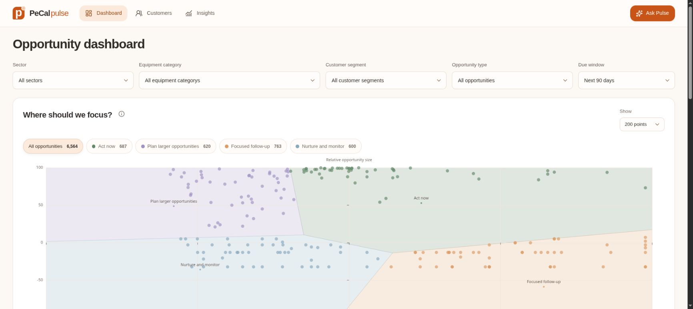
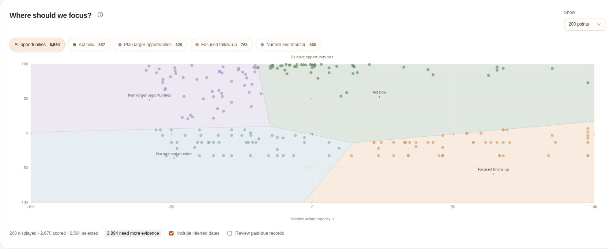
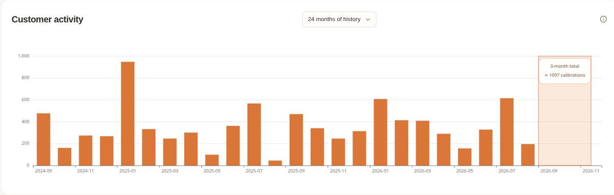
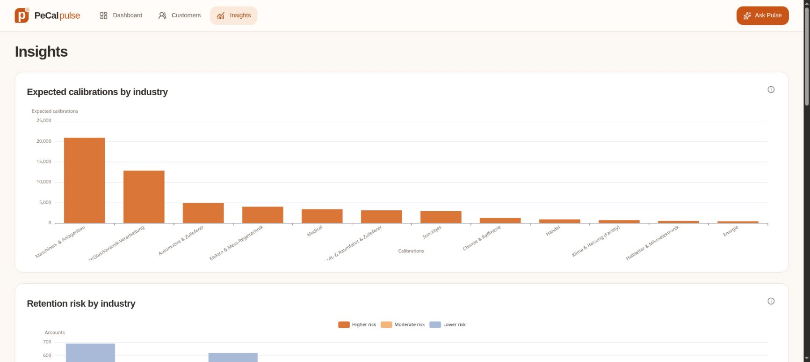
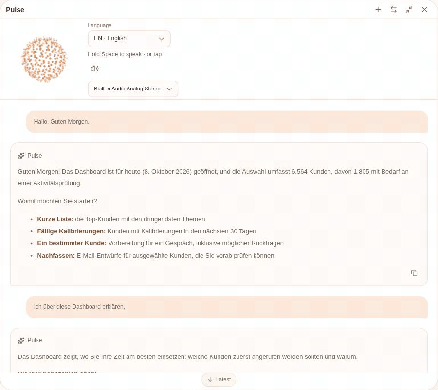

# PeCal Pulse

A sales assistant that turns calibration history into customer priorities, forecasts and useful follow-ups.

**First place at Hack The Lab by Perschmann Calibration.** Built by a team of four, with a Next.js workspace, Python analytics and an AI assistant that can operate the interface.

## What it does

- **Dashboard:** explore four opportunity groups, filter the cohort and review a ranked customer shortlist.
- **Customers:** inspect calibration history, a three-month activity outlook, upcoming requirements and services worth discussing.
- **Insights:** explore sector activity, forecasts, correlation and model-quality disclosures.
- **Pulse:** speak in English or German, ask for charts, change filters, open customer details, assign accounts and prepare follow-up email drafts.
- **Follow-ups:** save owners, dates and next steps; review and copy email drafts. Emails are not sent automatically.

Charts generated by Pulse appear in the conversation and can be enlarged. Workspace actions use typed tools and retain the current page context. Conversations and local workflow records persist in SQLite.

## How a sales representative uses it

Choose an opportunity group → inspect an account's history and upcoming calibration needs → ask Pulse to prepare a conversation → save an owner and follow-up. The same workflow works through visible controls or spoken requests.

Try: **“Show customers with calibrations due in the next 30 days and open the first account.”** Or ask Pulse to compare sector activity and draw charts in the conversation. Drafts remain available for review; the assistant does not send emails or update the source database.

## Screenshots

Historical workspace views with account identifiers and customer lists excluded. A public clone starts with synthetic demo data.

**Dashboard — choose where to focus.** Opportunity groups combine urgency and quantity-based potential, independently of customer segments.



**Complete opportunity map:** all four regions and both axes. Horizontal position shows relative action urgency; vertical position shows quantity-based opportunity size. These are opportunity groups, separate from behavioral customer segments.



**Customers — understand past activity and the next three months.** Bars show completed calibrations; shading marks the forecast window and estimated total.



**Insights — compare industries.** Sector-level views support planning and show where calibration activity is concentrated.



**Pulse — saved conversation walkthrough.** This silent GIF shows two captured views of an existing German voice conversation in the real frontend. It is a history walkthrough, not a live tool-execution or speech recording.



[View the readable assistant screenshot](media/agent.jpg).

Live tool-action recordings and enlarged agent-created charts are still pending. GIFs cannot carry speech audio; spoken demonstrations need a video.

## Data science: what, how and why

| Decision | Method | Why we use it |
|---|---|---|
| Understand customer behavior | **K-means segmentation** on standardized recency, calibration volume, active-month frequency, batch size, variability and equipment-category breadth; up to 24 months of history | Separates frequent, intermittent, occasional and long-inactive behavior. Candidate cluster counts are compared using silhouette and agreement across random seeds; sparse histories remain unclassified. |
| Decide where to focus | **Four opportunity groups** based on timing urgency and quantity-based opportunity size | These groups can contain customers from any behavioral segment. Frozen cohort percentiles make axes comparable; stable K-means regions are used when quality gates pass, otherwise explicit decision zones are shown. Filters do not refit the map. |
| Estimate whether a customer will return | **Logistic regression**, compared with gradient-boosted trees and simple baselines; raw and isotonic-calibrated probabilities evaluated | Predicts at least one calibration in the next three complete months. The historical run selected logistic regression; probability quality is checked using Brier score and ROC AUC. |
| Estimate three-month calibration volume | **Previous 12 months ÷ 4**, compared with Extra Trees, gradient boosting and seasonal/recent-volume baselines | The simple baseline performed better on validation MAE than the more complex candidates. The interface shows a shaded future window and its estimated total, rather than inventing monthly precision. |
| Review unusual inactivity | **Cadence-aware deviations** plus empirical future-return rates after periods of silence | Helps identify conversations worth having without treating every long calibration cycle as customer loss. |
| Explore sector trends and additional services | **Sector time-series baselines**, Pearson correlation of log-transformed monthly changes, and industry-peer category prevalence | Supports planning and specific discovery questions. Co-movement is not causation; a peer's equipment does not establish what this customer owns. |

Models are evaluated chronologically: training, probability-calibration, validation and held-out test windows follow time order. Model choice uses validation results; holdouts assess generalization. Volume quality uses MAE and WAPE, with segment-level disclosures. WAPE is aggregate forecast error, not an individual customer's accuracy. Offline pipelines publish prepared artifacts; requests do not retrain models.

Opportunity priority combines visible evidence, timing and quantity-based potential. It is a decision-support score, not expected profit or a measured benefit of outreach. The public synthetic demo does not reproduce the private historical model evaluation.

## Run locally

Requires Python 3.13+, uv, Node.js and pnpm.

```bash
uv sync
pnpm --dir frontend install
cp .env.example .env
bash scripts/dev.sh
```

Open **http://127.0.0.1:3000**. The API documentation is at **http://127.0.0.1:8001/docs**.

The public repository uses explicitly synthetic demo data. The private source database, its schema, exports, trained historical artifacts and customer records are excluded from this repository and its published history.

For the AI assistant, set `OPENROUTER_API_KEY` and `LLM_MODEL` in the ignored root `.env`. `RESONING_LVL=low` controls the configured model's reasoning effort. For streaming voice, also set `LIVEKIT_URL`, `LIVEKIT_API_KEY` and `LIVEKIT_API_SECRET`; LiveKit Cloud inference access is required. Hold Space to speak and release to send, or tap the orb. Pulse speaks a brief acknowledgement and final summary, while details stay in chat.

## Architecture

- **Frontend:** Next.js, TypeScript, assistant-ui, ECharts, Zustand and Motion; selected React Bits components.
- **Backend:** FastAPI, LangChain/LangGraph, OpenRouter and SQLite conversation checkpointing.
- **Analytics:** scikit-learn and NumPy; offline feature preparation, segmentation, chronological evaluation and activity/quantity baselines.
- **Voice:** LiveKit WebRTC, Deepgram speech recognition and Cartesia speech synthesis.

Application contracts describe the normalized inputs consumed by the app; they do not expose the proprietary source database schema. Private deployments can supply compatible snapshots under ignored `data/runtime/`. APIs serve prepared results rather than training models during a request.

Activity probability describes future observed calibration activity. It is not confirmed churn or sales conversion. Quantity estimates are calibrations, not distinct orders or revenue. Peer comparisons support discovery questions. Historical evidence requires checking current contact and quotation status before outreach.

## Development checks

```bash
uv run python -m unittest discover -s backend/tests -q
pnpm --dir frontend typecheck
pnpm --dir frontend exec node --test tests/*.test.mjs
```

Stop the frontend before running `pnpm --dir frontend build` to avoid mixing a running preview with regenerated assets.

## Project history

The development commits and teammate branches are retained. Public history was sanitized to exclude proprietary database material and internal research; this changes commit hashes while preserving the development sequence and branch structure.

## Development credits

Built by our four-person team with AI-assisted development using **OpenAI Codex — GPT-6.1 Sol, medium reasoning**, and **Muse Spark 1.3, high reasoning**. These are development-tool credits; the application's runtime model is configured separately through `LLM_MODEL`.
